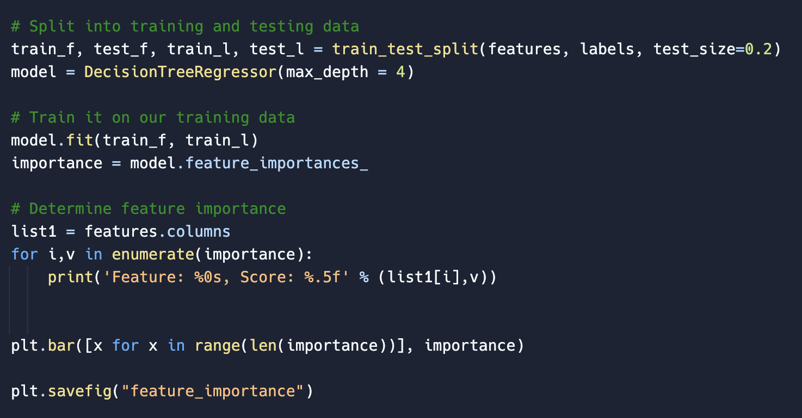
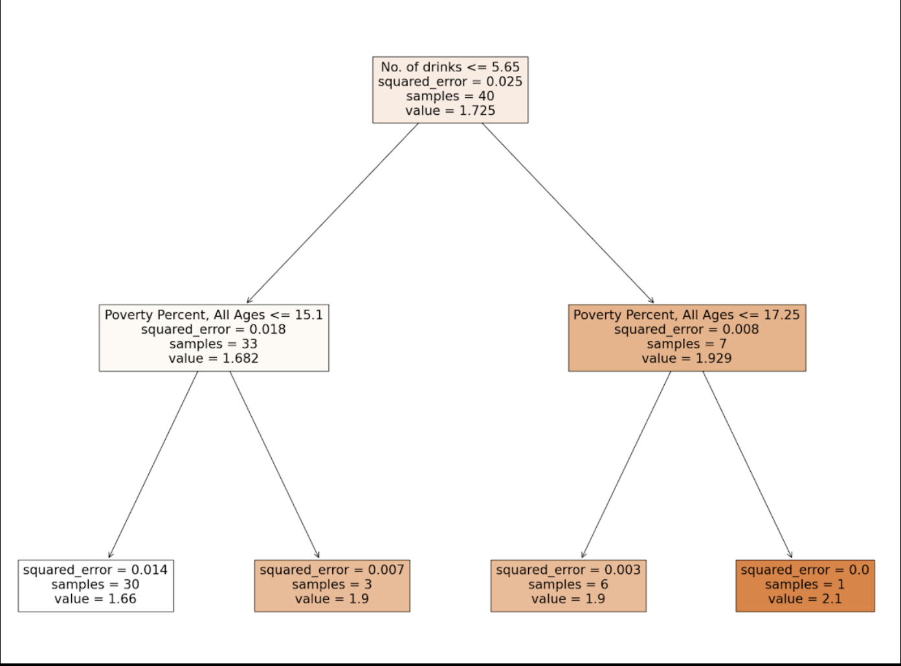
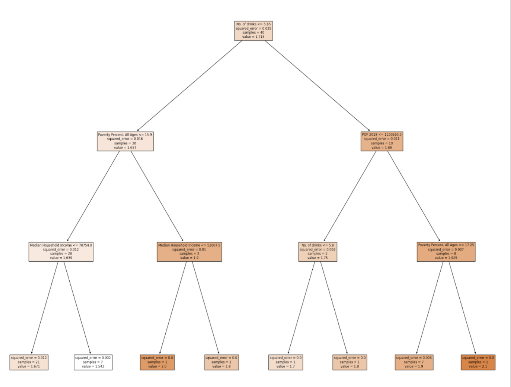
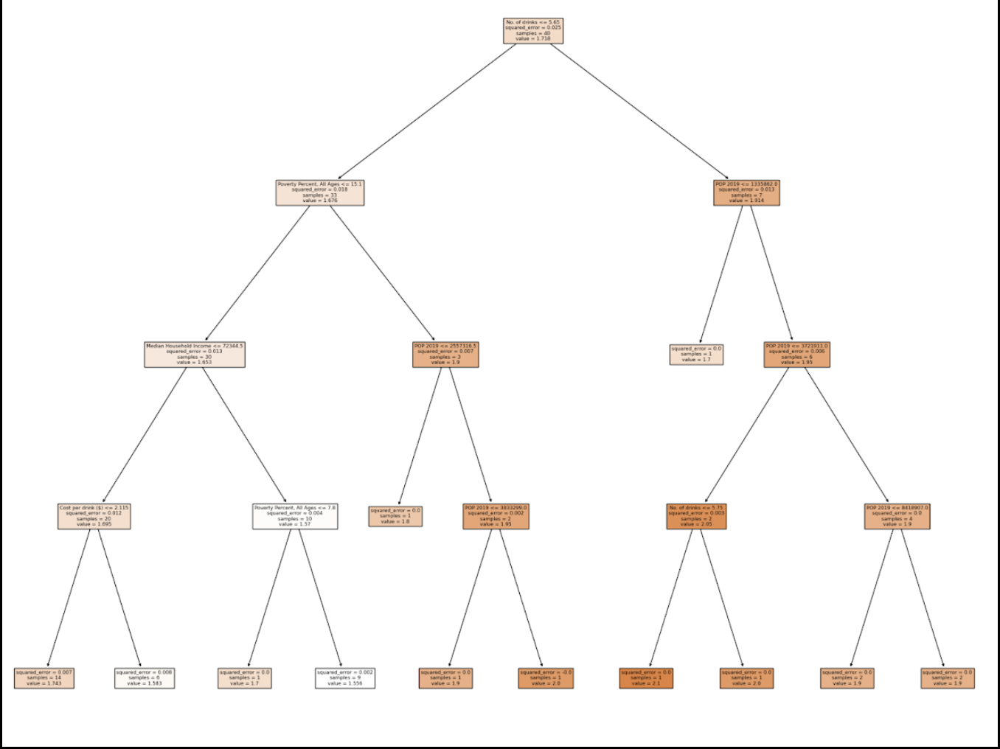

# Leveraging ML

As previously discussed, there are two principal categories of models: classification and regression. When conducting computations and analysis for your final project, it is important not to merely present numerical outputs. You need to ask yourself what the real-world significance is and draw practical implications. Use your correlations and models to identify patterns and trends, which, in turn, form the basis for making informed predictions.

There are a few approaches you can take to draw effective and insightful information from the performance of an ML model. For the problem provided as an example, four different approaches are taken.

## Example Situation

The prevalence of alcohol abuse remains a significant public health concern in the United States. To address this pressing issue and gain insights into the factors influencing alcohol abuse rates, a machine learning (ML) model has been developed.

The following creates a regression model to predict the alcohol prevalence (label) in a state in the US given information that represents that state (features). For the context of this problem, alcohol prevalence is defined as the median number of binge drinking occasions in a period of 30 days.

::::{tab-set}
:::{tab-item} Features
Median Household Income, Poverty Percent, Ages, Cost per Drink ($), Population Density, Graduation Rates
:::
:::{tab-item} Label
Alcohol prevalence (Median No. of Binge Drinking Occasions)
:::
:::{tab-item} Dataset

:::
::::

## Model Performance Evaluation

The first approach is assessing the model's performance metrics, such as mean squared error. This allows you to gauge the model's accuracy and generalization capabilities and understand how well it is likely to perform on new, unseen data.

::::{tab-set}
:::{tab-item} Mean Squared Error
**Train Error:** 0.0061  
**Test Error:** 0.0250

**Note:** Do not list long, overly precise values. If your training error is 0.006199999, report it as 0.0061.
:::
:::{tab-item} Comments
The model was accurately able to predict the alcohol prevalence value as indicated by the small testing error.

This is a good start, but stopping at this point is not sufficient for the final project. There are many unanswered questions. What implications does this have? What predictions can be made? Which features are most important, if any?
:::
::::

## Identifying Important Features

The second approach is analyzing the feature importances to determine which variables have the most significant impact on the predicted outcome. This information is crucial for understanding the driving factors influencing the label.

Using the API provided by `DecisionTreeRegressor`, you can determine which features are most influential in the model's predictions.

::::{tab-set}
:::{tab-item} Code
```python
# Split into training and testing data
train_f, test_f, train_l, test_l = train_test_split(features, labels, test_size=0.2)
model = DecisionTreeRegressor(max_depth=4)

# Train it on our training data
model.fit(train_f, train_l)
importance = model.feature_importances_

# Determine feature importance
for feature, score in zip(features.columns, importance):
    print(f"Feature: {feature}, Score: {score:.5f}")

plt.bar(range(len(importance)), importance)
plt.savefig("feature_importance")
```
:::
:::{tab-item} Output
> Feature: Median Household Income, Score: 0.23044  
> Feature: No. of drinks, Score: 0.42769  
> Feature: Poverty Percent, All Ages, Score: 0.25019  
> Feature: Grad Rates: 2015-2019, Score: 0.03506  
> Feature: POP 2019, Score: 0.05662  
> Feature: Cost per drink ($), Score: 0.00000
:::
:::{tab-item} Comments
Although the exact numbers varied each time, the general trend showed that the most influential feature was the median number of drinks on one occasion, and the second most influential feature was median household income.

A higher score means that the feature has a larger effect on the model used to predict the label.
:::
::::

## Decision Tree Analysis

The third approach is analyzing the decisions the model makes. You can print images of a decision tree using the API provided by scikit-learn and use the `max_depth` hyperparameter to observe how limiting the tree changes the decisions made at each node.

::::{tab-set}
:::{tab-item} Code
```python
# Split into training and testing data
train_f, test_f, train_l, test_l = train_test_split(features, labels, test_size=0.2)
model = DecisionTreeRegressor(max_depth=4)
model.fit(train_f, train_l)

fig = plt.figure(figsize=(25, 20))
tree.plot_tree(
    model,
    feature_names=features.columns,
    filled=True,
)
fig.savefig("decision_tree.png")
```
:::
:::{tab-item} Max Depth: 2

:::
:::{tab-item} Max Depth: 3

:::
:::{tab-item} Max Depth: 4

:::
::::

After analyzing the trees, the first decision in each version was based on the number of drinks, which supports its high feature-importance score. The second level mainly involved poverty percentage and 2019 population, even though their calculated importances did not appear as strong. Median household income appeared once or twice at later levels, while poverty percentage, number of drinks, and population were repeated frequently.

Cost per drink was used only once in the depth-four tree, and college graduation rates were not used in any tree. From this, the group concluded that number of drinks was the most influential feature and chose a maximum depth of four to balance underfitting and overfitting.

## Prediction and Forecasting

The fourth approach is using a regression model to predict and forecast numerical values from historical data. Its predictions can reveal trends, patterns, and behaviors that support decisions such as:

1. **Public health policy:** Develop targeted interventions and awareness campaigns based on predicted alcohol-consumption patterns.
2. **Alcohol addiction and treatment:** Identify areas with higher predicted usage so resources and treatment programs can be directed where they are most needed.
3. **Socioeconomic patterns:** Examine relationships between alcohol use and social factors such as income, education, and employment.
4. **Alcohol-related accidents and crimes:** Target prevention and enforcement measures in areas with higher predicted consumption rates.
